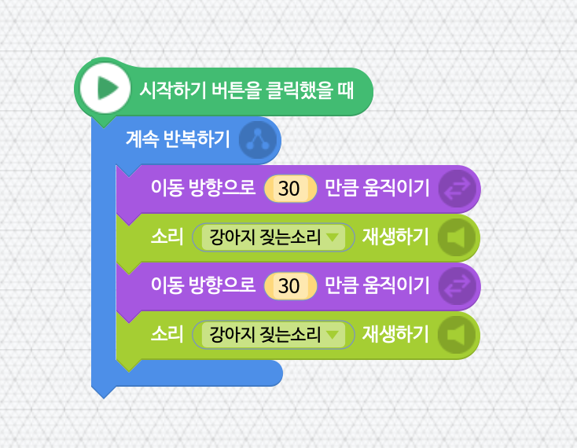
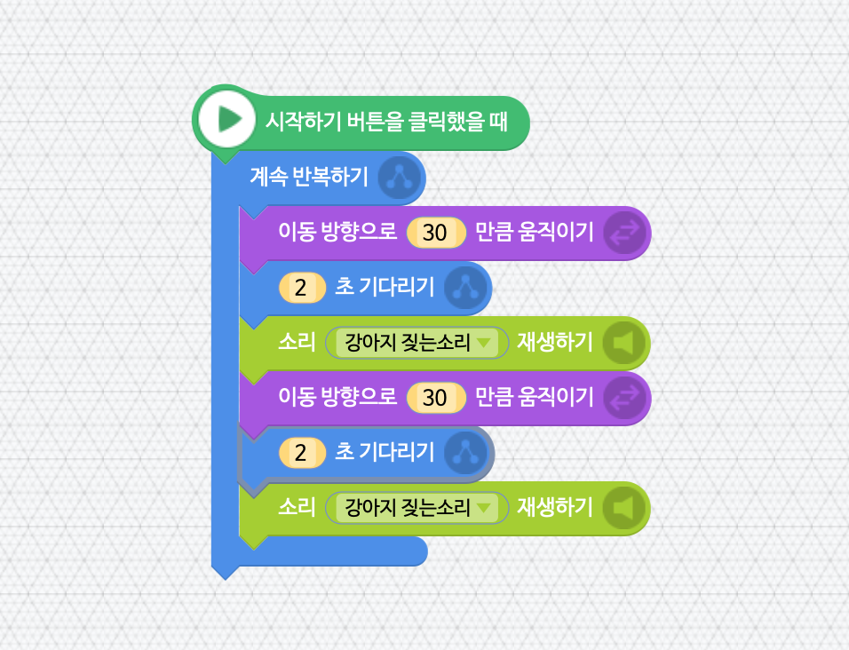
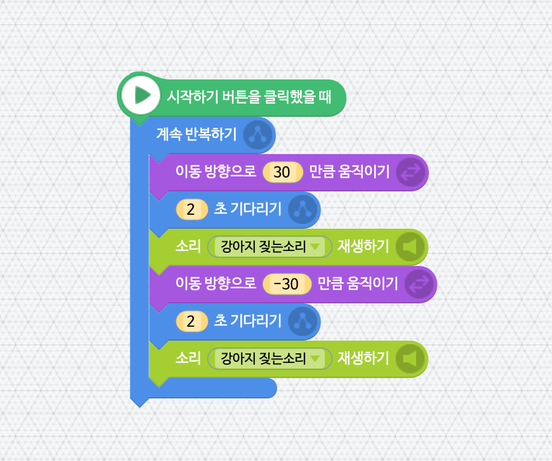

###### 2019년 4월 4일 수업 자료.

# 첫 번째 교실

> #### 참고  
> 3월 21일과 3월 28일은 초등학생 중 불참자가 있던 관계로 학생들과 매칭 봉사자들이 각자 친해지며 여러 가지 엔트리 기초 튜토리얼을 진행했습니다. 본격적인 교육 과정은 4월 4일부터 시작됩니다.

## [충직한 강아지](https://playentry.org/tt#!/custom/lecture/view/589ae756a98f578b27247044)

엔트리를 통해 주인을 지키기 위해 이리저리 짖고 다니며 나쁜 사람들을 쫒아내는 강아지를 만들어보아요.

## 목표
* `Object`가 움직이면서 짖게 만들기.
* `Object`가 일정한 시간 간격을 두고 움직이게 만들기.

## 움직이면서 짖게 만들기



### 엔트리파이선 코드

```python
import Entry

def when_start():
    while True:
        Entry.move_to_direction(30)
        Entry.play_sound("강아지 짖는소리")
        Entry.move_to_direction(30)
        Entry.play_sound("강아지 짖는소리")
```

## 2초 시간 간격을 두고 움직이게 만들기



### 엔트리파이선 코드

```python
import Entry

def when_start():
    while True:
        Entry.move_to_direction(30)
        Entry.wait_for_sec(2)
        Entry.play_sound("강아지 짖는소리")
        Entry.move_to_direction(30)
        Entry.wait_for_sec(2)
        Entry.play_sound("강아지 짖는소리")
```

## 강아지가 왕복하게 만들기



### 엔트리파이선 코드

```python
import Entry

def when_start():
    while True:
        Entry.move_to_direction(30)
        Entry.wait_for_sec(2)
        Entry.play_sound("강아지 짖는소리")
        Entry.move_to_direction(-30)
        Entry.wait_for_sec(2)
        Entry.play_sound("강아지 짖는소리")
```

## 도전
* 자신이 원하는 이동 길이와 이동 간격을 설정해서 강아지의 움직임을 마음대로 바꾸어 볼까요?

