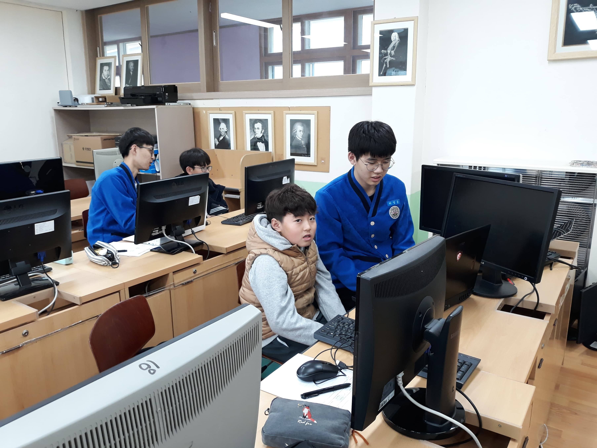
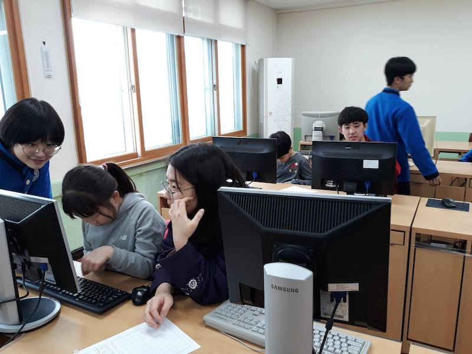
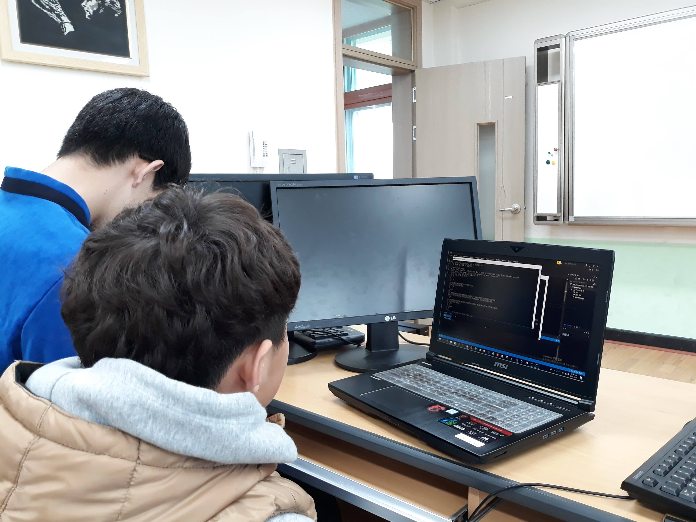
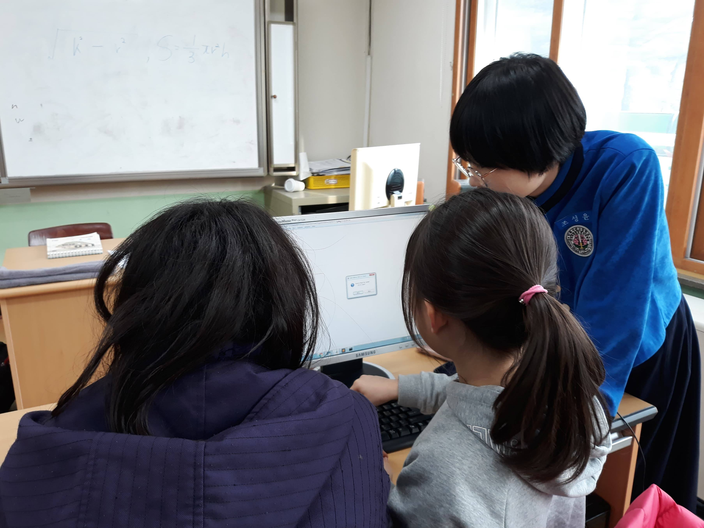
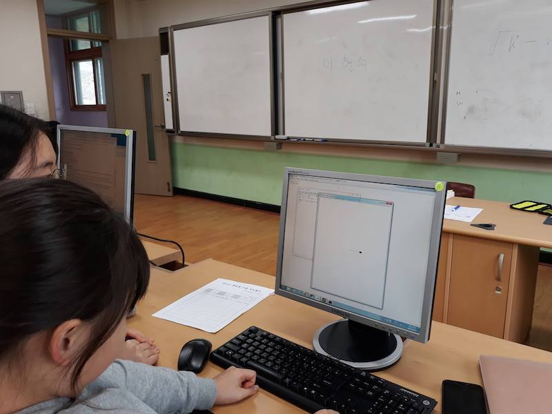

# 첫 번째 교실
## 날짜
### 2019년 3월 21일 목요일

## 참석자
|참석자|역할|비고|
|----|----|----|
|노건호|총괄 & 부족한 부분 보강||
|김상윤|`박승리` 학생의 일대일 멘토||
|김희원|`이윤서` 학생의 일대일 멘토||
|이정달|`임태준` 학생의 일대일 멘토||
|이태훈|`김한준` 학생의 일대일 멘토||
|조성윤|`김연아` 학생의 일대일 멘토||
|최정웅|`홍준표` 학생의 일대일 멘토||
|한승민|`김민찬` 학생의 일대일 멘토||

## 교육 철학 & 수업 방향
앞에서 강사 혼자 강의하는 수업은 학생들의 수동적 학습을 강요하며, 본인의 열정과 호기심이 가장 중요한 코딩의 장점을 퇴색시킵니다. 기존의 코딩 교육 방식에 큰 문제점을 느낀 BCD의 멤버들은 이를 **자체 제작 교육 과정**과 **일대일 방식의 멘토링**을 통해 해결하려 노력했습니다.

* 학생들 수준에 맞춰 **모든 Python 교육 자료 자체 제작**
* 학생이 배우고 싶은 것을 정하면 봉사자들이 공부하여 가르쳐주는 **학생 주도 일대일 멘토링**
* 전부 **무료 Open Source**로 공개함

각각의 봉사자들은 배우미 옆에서 직접 코딩을 가르쳐주며, 학생들이 스스로 목표에 도달할 수 있도록 지도해줍니다. 이와 같은 방식을 통해서 일대 다수의 수업에서는 얻기 힘든 맞춤형 교육을 실행합니다. 학생들이 질문을 하면 배우미들이 이해가 될 때까지 자세히 설명해줄 수 있고, 특별히 더 궁금하거나 흥미로운 주제가 있다면 이에 대해 자유롭게 공부해볼 수 있습니다.

또한 BCD의 모든 수업 자료는 HTML 문법과 Code Snippet을 활용한 **Markdown 문서**로 제작되며, 누구나 사용할 수 있도록 [GitHub 저장소](https://github.com/bcdkmla/dunnae2019)에 **Open Source**로 공개되어 있습니다.

## 강의 내용 & 수업 자료
동일한 내용의 수업 자료를 [GitHub 오픈 소스 저장소](https://github.com/bcdkmla/dunnae2019/blob/master/PythonCurriculum/PythonClass1.md)에서도 확인하실 수 있습니다.
<details><summary> 2019년 3월 21일의 수업 내용을 보려면 여기를 클릭하세요. </summary>

### Python의 설치

> 둔내초등학교 컴퓨터실은 Windows 컴퓨터만 있는 관계로, 앞으로의 모든 내용은 Windows를 기준으로 서술될 예정입니다.

1. [Python 홈페이지](https://www.python.org)에 접속합니다.
   * [Windows Python Download](https://www.python.org/downloads/windows/)
   * [macOS Python Download](https://www.python.org/downloads/mac-osx/)
1. 원하는 버전의 Python 설치 프로그램 중 다음의 표를 참고해서 알맞는 Python 설치 프로그램을 내려 받습니다.

|Windows|다운로드할 파일|
|----|----|
|64 bit|Windows x86-64 executable installer|
|32 bit|Windows x86 executable installer|

1. 다운로드가 끝나면 그 파일을 실행시킵다.
1. 설치 창에서 다음 항목들이 선택된 것을 확인하고 `Install Now`를 누릅니다. Path에 추가하는 이유는 `cmd.exe`에서 Python을 바로 실행시킬 수 있기 때문입니다.
   * `Add Python to PATH`
   * `Install launcher for all users`
1. 설치가 끝나고 나면 `Disable path length limit`을 누릅니다. Windows의 글자 수 제한을 막기 위해서 입니다.
1. 모든 설치가 종료되면 `Close` 버튼을 클릭하여 창을 닫습니다.

### Sublime Text의 설치
* [Sublime Text](https://www.sublimetext.com) 홈페이지에 접속하여 Sublime Text를 설치합니다.

### 그 외에 하면 좋은 것들
* Windows 탐색기를 열어 파일 확장자를 항상 표시하도록 해둡니다.
* `.py` 확장자를 Sublime Text로 항상 열도록 설정해둡니다.

----

### 인터프리터: Hello, World!

1. `cmd.exe`를 실행해 `python`을 작성하고 `enter`을 누릅니다.
1. 다음과 같은 내용이 보일 것입니다.

	```console
	/* 버전 정보, OS 정보 */
	Type "help", "copyright", "credits" or "license" for more 	information.
	>>>
	```

1. 이를 Python Interpreter라고 합니다. 우리는 지금 Python Interpreter를 대화형 모드로 사용하고 있는 것입니다. 대화형 모드는 말 그대로 컴퓨터와 우리가 대화하듯이 상호 작용한다는 것입니다.

	```console
	Type "help", "copyright", "credits" or "license" for more information.
	>>> 1+1
	2
	```

1. `print()`는 `cmd.exe` 같은 `console`에 무언가를 출력하는 `프린터` 같은 도구입니다.
1. 즉, 우리가 `Python`에게 `print()`를 이용해서 무언가를 출력하라고 할 수 있습니다.
1. 대신 우리가 출력하고 싶은 말을 할 때는`''`나 `""`를 이용해 우리가 말하고 싶은 부분을 표시해줘야 합니다.
1. 만약 "안녕하세요!"를 인쇄하고 싶다면, 인터프리터에 다음과 같이 작성해보세요.

	```console
	Type "help", "copyright", "credits" or "license" for more information.
	>>> print("안녕하세요!")
	안녕하세요!
	```

### 도전 과제
* 자신의 이름을 출력해보기
* 자기가 가장 좋아하는 동물을 출력해보기
* 자기가 좋아하는 동물을 출력하고, 바로 옆에 다시 좋아하는 식물을 출력하기.


<details><summary>정답 확인하기</summary>
<p>

```python
print("조성현")
print("고양이")
print("고양이", "선인장")
```
</p>
</details>

----

### Python 파일 실행하기
1. `cmd.exe`를 엽니다.
1. 자신이 열고자 하는 `Python` 파일의 폴더로 이동합니다.
1. 다음 명령어들을 사용하면 편리합니다.

	|명령어|기능|
	|----|----|
	|`dir`|현재 폴더 안에 들어있는 모든 파일을 출력합니다.|
	|`cd ` + NAME | 이 폴더 내에 존재하는 폴더 중 'NAME'이라는 이름을 가지는 폴더로 이동합니다.|
	|`cd ..` | 상위 폴더로 이동합니다.|

1. `python (파일 이름).py` 라고 입력히고 Enter 키를 누릅니다.
1. `Python` 파일이 실행되는 것을 볼 수 있습니다.

### 도전 과제
* 미리 `dunnae2019` Repository를 저장해두었다고 할 때, `Snowflake.py`를 실행해보기.

<details><summary>정답 확인하기</summary>
<p>

`dunnae2019` Repository가 바탕화면에 `git clone` 되어 있다고 할 때,

```console
$ cd Desktop
$ cd dunnae2019
$ cd Snowflake
$ python Snowflake.py
```
</p>
</details>

</details>

## 수업 리포트

<details><summary>봉사자 김상윤, 배우미 박승리의 수업 리포트</summary>

----

|봉사자|배우미|
|----|----|
|김상윤|박승리|

### 수업 내용
컴퓨터 프로그래밍이 정확히 무엇인지, python이라는 언어가 어떤 방식으로 작동하는지를 설명했습니다. 그리고 `print`와 같이 간단한 python 문법도 가르쳤습니다. 더불어 cmd에서 옆에 써져 있는 문장들이 의미하는 것을 설명한 뒤, 간단하게 파일 밖으로 나가는 법과 자신이 파일 속으로 들어가는 법을 가르쳤습니다.

### 이해도
학생이 수업에 큰 흥미를 들인 것처럼 보이지는 않았지만 말은 잘 듣는 것 같았습니다. 덕분에 제가 가르친 python `print`나 cmd의 `cd ~~~` 명령들은 혼자서도 잘 수행했습니다.

### 어려웠던 점
가르치는 데 어려웠던  점은 타자 속도인데, 물론 저도 타자 속도가 그다지 빠르지는 않았지만 학생은 수월하게 가르치는 데 어느정도 지장이 있었다고 생각합니다. 그래서 어느정도 학생이 혼자서 연습해서 왔으면 더욱 더 좋을 것 같습니다.

### 수월했던 점
학생이 수업에 대하여 특별히 거부감을 느끼지 않았습니다.

### 제안 & 느낀 점
어느정도 학생이 혼자서 타자를 연습해서 왔으면 더욱 더 좋을 것 같습니다.

----

</details>

<details><summary>봉사자 김희원, 배우미 이윤서의 수업 리포트</summary>

----

|봉사자|배우미|
|----|----|
|김희원|이윤서|

### 수업 내용
프로그래밍에 대한 기초적 설명, Python 설치 방법, 변수, 연산자, `for`

### 이해도
잘 따라오고 내용을 이해하는 듯 했으나 직접 코드를 작성하는 정도는 아니었습니다. 하지만 수업 중간 중간에 이해했는지 흥미는 있는지 확인차 물어보면 이해했다고 대답하였고 흥미도 있어 보였습니다.

### 어려웠던 점
학생이 기본 지식이 어느 정도 되는지 몰라서 어디서부터 어떻게 가르쳐야 할지 난감했고 이해하고 있는지 판단하는 것도 어려웠습니다. 또 초등학생의 눈높이에서 어떻게 설명할까 고민을 많이 했고 초등학생의 집중력을 어떻게 잘 활용할 수 있을지도 의문이었습니다.

### 수월했던 점

### 제안 & 느낀 점
파이썬보다 더 쉬운 언어로 프로그래밍의 기초부터 배우는 것은 어떨까 생각했습니다. 내가 아는 내용이 초등학생에게 잘 전달되고 있는건지도 확신이 없었습니다. 처음 해보는 경험이었기에 많이 어려웠지만 생각보다 친구가 잘 따라와줘서 뿌듯함도 많았습니다.

----

</details>

<details><summary>봉사자 이정달, 배우미 임태준의 수업 리포트</summary>

----

|봉사자|배우미|
|----|----|
|이정달|임태준|

### 수업 내용

처음에 코딩이라는 것에 대해서 설명을 했습니다. 인간과 인간이 의사소통하는데 언어가 필요하듯이 인간과 컴퓨터가 소통하는 데에도 컴퓨터 언어가 필요하고 그 언어를 컴퓨터에 입력해주는 과정이 코딩이라고 했습니다. 그런데 인간의 언어에 영어, 한국어, 중국어 등 다양한 종류가 있는 것처럼 컴퓨터 언어에도 마찬가지로 파이썬, 엔트리 같은 종류가 있다고 설명해주었습니다.

그리고는 파이썬을 같이 설치해서 cmd를 이용하여 `print`를 해보았습니다. `print`를 이용해 ‘안녕하세요’를 출력해보았고, 학교, 반, 번호, 이름도 출력해보았습니다. Sublime Text 설치나 눈송이 프로그램은 아직 실행해보지 못했습니다.

### 이해도
많은 부분을 이해하지 못하는 것 같습니다. 코딩이 무엇인지는 엔트리를 했었기 때문에 아는 것 같은데 우선 영어에서 어려움이 있습니다. 초3 이다보니 아직 알파벳을 잘 모르고 영어 타자도 안 돼서 print 한 단어 쓰는데 30초 넘게 걸립니다.

### 어려웠던 점
영어가 안 되니 수업 진행이 어려웠습니다.

### 수월했던 점
없습니다.

### 제안 & 느낀 점
제가 맡은 학생의 경우는 초3이다보니 초6과는 다른 과정으로 교육을 진행해야 할 것 같습니다. 영어를 모른다고 해서 많이 당황스러웠고 앞으로 어떻게 진행해야할지 막막하지만 한 번 대책을 생각해보아야 할 것 같습니다.

----

</details>

<details><summary>봉사자 이태훈, 배우미 김한준의 수업 리포트</summary>

----

|봉사자|배우미|
|----|----|
|이태훈|김한준|

### 수업 내용
학생이 독감 때문에 수업에 오지 못하였습니다.

### 제안 & 느낀 점
6학년들을 제외한 학년들은 영어와 알고리즘에 대한 이해가 부족한 것 같습니다. 따라서 파이썬을 배우기 전에 스크래치와 같은 프로그램으로 알고리즘을 먼저 이해하는 것이 필요할 것 같았습니다.

----

</details>

<details><summary>봉사자 조성윤, 배우미 김연아의 수업 리포트</summary>

----

|봉사자|배우미|
|----|----|
|조성윤|김연아|

### 수업 내용
학생이 출석하지 않아 수업을 하지 못했습니다.

----

</details>

<details><summary>봉사자 최정웅, 배우미 홍준표의 수업 리포트</summary>

----

|봉사자|배우미|
|----|----|
|최정웅|홍준표|

### 수업 내용
Python을 설치하고 Sublime text 3를 설치하였습니다. 또한 Snowflake.py를 실행시켜 보여주었고, 수업의 궁극적인 목적을 알려주었습니다. 이후 Python을 이용해 자신의 이름이나 문장을 프린트하는 방법을 배웠습니다. 또한 사칙연산과 그 외의 특수 문자 중 일부를 배웠습니다.

### 이해도
수업은 전체적으로 이해를 하긴 하지만 수업의 동기에 대해서는 완벽하게 공감하지 못한 것 같습니다.

### 어려웠던 점
Snowflake.py를 보여줄 때까지는 관심을 가지며 잘 따라오려고 하였지만 사칙연산의 기호를 배우면서 점점 지루해 한 것 같습니다.

### 수월했던 점
생각보다 잘 따라와주고, 파이썬에 사용되는 언어가 영어인데도 불구하고 잘 이해하고 사용하여 주었습니다.

### 제안 & 느낀 점
수업을 할 때 게임과 같은 활동을 만들어서 하는 것도 괜찮을 것 같습니다.

----

</details>

<details><summary>봉사자 한승민, 배우미 김민찬의 수업 리포트</summary>

----

|봉사자|배우미|
|----|----|
|한승민|김민찬|

### 수업 내용
프로그래밍 언어의 개념을 배웠고, Python과 Sublime Text의 쓰임과 중요성에 대해 알아보았습니다. 그리고 이를 cmd라는 명령창을 이용해 Python을 실행시킬 수 있다는 것을 가르쳐 보았습니다. cmd 프로그램을 사용하여 Python을 통해 `print`를 익혔습니다. 사칙연산 기호와 나머지 기호를 알아보고 실제로 활용해보았습니다. Snowflake.py라는 프로그램을 직접 구동해보며 Python의 효용성에 대해 알아보았습니다.

### 이해도
수업 과정에 대한 학생의 이해는 매우 뛰어났습니다. 딱히 어려워하는 부분 없이 잘 따라와 줬습니다. 처음 프로그래밍 언어의 개념을 설명할 때에는 잠시 이해가 안되는 모습도 보여주었지만, 익숙한 엔트리와 비교하며 설명하자 잘 이해했습니다.

### 어려웠던 점
가르치는 데에 어려운 점은 딱히 없었습니다. 친구가 컴퓨터나 프로그래밍에 관심이 많아 수업을 잘 따라와 줬습니다.

### 수월했던 점
친구가 6학년이고, 미리 엔트리를 다뤄보았던 경험이 있어 가르치기에 수월했습니다.

### 제안 & 느낀 점
수업을 듣는 친구들 중에는 아직 알파벳도 익히지 못해 프로그래밍에 어려움을 겪는 친구도 있고, 반대로 수업을 잘 따라와 주는 친구도 있습니다. 수업을 하며 수도권과 지방의 교육격차를 실감할 수 있었습니다. 수도권의 초등학교 3학년이라면 알파벳은 기본이고, 몇몇 학생들은 더 높은 과정의 학습을 하지만, 제가 만난 횡성의 초등학생 3학년은 알파벳조차 몰랐습니다. 비록 제가 가르친 것은 프로그래밍이지만 이를 통해 사회문제를 직접 체감할 수 있다는 점이 인상깊었습니다. 

----

</details>

## 활동 사진




