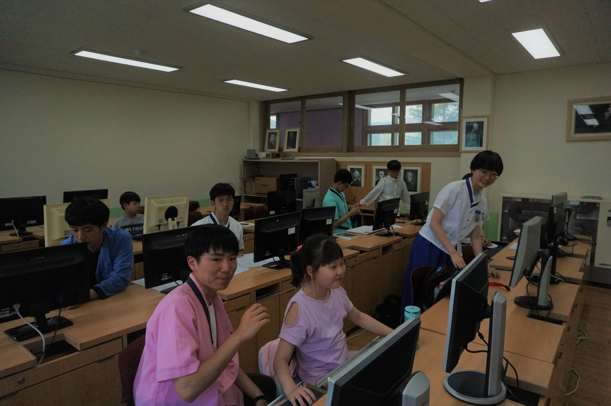
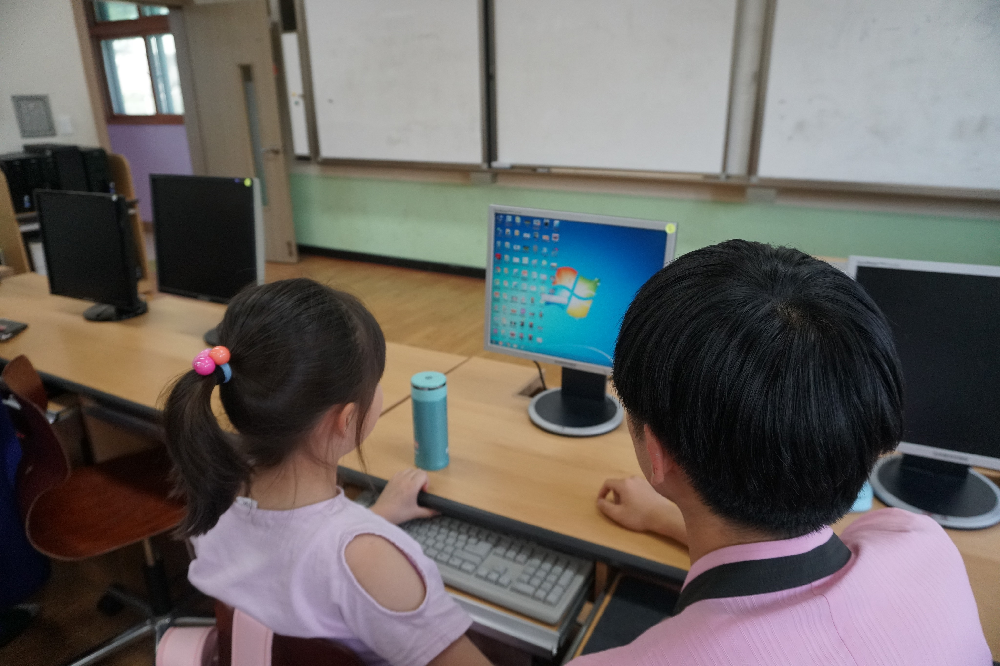

# 날짜
### 2019년 4월 25일 목요일

## 활동 인원
|활동 인원|역할|비고|
|----|----|----|
|노건호|총괄 & 부족한 부분 보강||
|김상윤|박승리 학생의 일대일 멘토||
|송정훈|이윤서 학생의 일대일 멘토||
|이정달|임태준 학생의 일대일 멘토||
|이태훈|김한준 학생의 일대일 멘토||
|조성윤|김연아 학생의 일대일 멘토||
|최정웅|홍준표 학생의 일대일 멘토||
|한승민|김민찬 학생의 일대일 멘토|||

# 강의 내용 & 수업 자료
동일한 내용의 수업 자료를 [GitHub 오픈 소스 저장소](https://github.com/bcdkmla/dunnae2019/blob/master/PythonCurriculum/PythonClass4.md)에서도 확인하실 수 있습니다.

#### 키워드
``list``

## Python List

다른 언어에서의 **배열**이 Python에서는 `list`라는 형태로 존재합니다. `list`는 번호(`index`)와 번호에 대응하는 **데이터**들로 이루어진 자료구조를 의미합니다. Python `list`에서는 **다양한 종류**의 데이터들이 순차적으로 저장됩니다.

Python `list`는 **동적 배열 (Dynamic Array)** 의 개념으로 구현되어 프로그램 수행 도중 `list`에 새 항목들이 추가 또는 삭제 된다면 `list`의 크기 가 변동 됩니다. 
    
### Python `list`의 사용
Python `list`는 다음과 같은 방법을 통해서 만들 수 있습니다.

```python
a = [1, 3 , 5, 7]
```

Python `list`는 다양한 형태의 값들이 들어갈 수 있습니다.

```python
a=[1,'A',3.5,True]
```

그리고 `list` 안의 값을 불러오고 싶다면 `index`를 통해서 접근가능합니다.

```python
a=[1,'A',3.5,True]
print(a[0]) #  1
print(a[1]) # 'A'
print(a[2]) #  5
```

만약 `list` 자체를 보고 싶다면

```python
print(a)
```

와 같이 `print()` 를 이용해서 할 수 있습니다.

* 학생들에게 `index` 넘버가 `1`이 아닌 `0`부터 시작한다는 것을 확실하게 가르쳐 줄 것!

### Python `list`의 사용 2

* `list`에 새로운 값을 추가하기

```python
a = [3, 4, 5]
a.append(6)
print(a) # [3, 4, 5, 6]
```

* 다른 `list`를 연결하기

```python
a = [3, 4, 5]
b = [6, 7]
a.extend(b)
print(a) # [3, 4, 5, 6, 7]
```

* `list` 안에 새로운 값을 넣기

```python
a = [3, 4, 5]
a.insert(2, 7) # a.insert(index, obj)
print(a) # [3, 4, 7, 5]
```

### Python `list`의 사용 3
* `list`의 정렬
**sort** : Python `list`에서는 기본적으로 sort 함수를 이용해서 `list`를 오름차순(작은 값이 앞, 큰 값은 뒤)으로 정렬할 수 있습니다.

```python
a = [1,23,4,6,2]
a.sort()
print(a) # [1,2,4,6,23]
```

만약 오름차순이 아닌 내림차순으로 정렬을 하고 싶다면

```python
a = [1,23,4,6,2]
a.sort(reverse=True)
print(a) # [23,6,4,2,1]
```
처럼 `sort(reverse=True)`를 사용하면 됩니다.

## 다음 문제를 풀어 봅시다.

A 라는 `list`에는 5명의 학생들의 시험 점수가 다음과 같이 담겨 있습니다

```python
A = [90,88,92,78,95]
```

1. 학생들의 점수가 담긴 `list` A를 정렬해서 1등한 친구의 점수를 출력해 봅시다.
1. 그런데 어느날 2명의 친구가 전학을 와서 점수가 각각 98점, 70점이었습니다. `list` A에 새로 전학온 친구들의 점수를 추가하고 가장 점수가 낮은 친구와 가장 점수가 높은 친구의 점수를 출력해 봅시다.

* `list`의 출력
* `list`의 추가
* `list`의 정렬
* `list`의 `index` 번호

### 정답

```python
A = [90,88,92,78,95]

A.sort(reverse=True) # 내림차순으로 정렬.

print(A[0])

A.append(98)
A.append(70)

A.sort(reverse=True)

print(A[-1]) # 가장 낮은 점수. -1번째는 뒤에서 첫 번째를 뜻합니다.
print(A[0])  # 가장 높은 점수.
```

또는 `max(<list>)`나 `min(<list>)`를 사용하면 훨씬 간편하게 답을 구할 수 있습니다.

```python
A = [90,88,92,78,95]

print(max(A))

A.append(98)
A.append(70)

print(min(A)) # 가장 낮은 점수
print(max(A)) # 가장 높은 점수
```

# 수업 리포트

----

## 봉사자 김상윤, 배우미 박승리의 수업 리포트

### 수업 내용
학생이 결석하여 수업을 진행할 수 없었습니다.

----

## 봉사자 송정훈, 배우미 이윤서의 수업 리포트

### 수업 내용
* 저번 시간에 진행했던 똥피하기 게임이 윤서가 프로그래밍 하기에는 조금 어려움이 있어서 오늘은 새로운 주제인 슈팅 게임 제작을 시작했습니다.
* 우선 총을 쏘는 캐릭터를 만들어서 캐릭터가 위, 아래로 움직일 때 총도 캐릭터를 따라서 같이 움직이게 했습니다.
* 그리고 총에서 총알이 나가는 것을 구현하였고, 없애야 하는 적도 만들어서 메인 캐릭터에게 계속 가까이 오도록 프로그래밍 했습니다.
* 오늘은 적이 총알에 맞아 없어지는 부분까지 프로그래밍 했습니다.
* 저는 프로그래밍을 직접 해야만 그 재미를 느끼고 기억에 남는다고 생각해서, 윤서에게 기본적인 논리 순서만 알려주고 본인이 직접 프로그램을 구성하도록 도와주었습니다.

### 이해도
* 똥피하기 게임을 저번에 만들어 보아서 그런지 오늘 수업의 진도는 정말 빠르게 나갈 수 있었습니다.
* 윤서가 저번 시간에 알려주었던 x축 개념과 y축 개념을 기억하고 있어서 윤서 본인이 오늘 수업을 이해하기 쉬웠던 것 같습니다.
* 또한, 윤서가 처음 배우는 지식도 습득이 굉장히 빨라 오늘 새롭게 시작한 개념들도 쉽게 소화해냈습니다.

### 어려웠던 점
* 윤서가 엔트리를 사용하는 것이 완전히 익숙하지는 않아서 계속 도와주어야 했던 것이 가장 힘들었습니다.
* 그러나 코딩을 시작하는 단계에서는 누구나 도움이 많이 필요하고, 윤서가 계속 엔트리로 프로그램을 제작하다 보면 나중에는 도움 없이 스스로 코딩을 할 수 있는 단계까지 충분히 도달할 수 있다고 생각합니다.

### 수월했던 점
* 확실히 윤서가 열정과 끈기, 그리고 명석함을 지니고 있어 가르치는 사람으로서는 이만큼 좋은 학생이 없다고 생각합니다.
* 모르는 것이 있으면 스스로 물어보고, 열심히 프로그래밍하여 잠깐 쉬는 것이 어떨까 제안해도 계속 프로그래밍을 하겠다고 하는 윤서를 가르치는 것은 굉장히 수월합니다.

### 제안 및 느낀 점
* 저번 모임에서 BCD 장 조성현 선배가 말씀해주신 것과 같이, 윤서에게 혹시 본인이 만들고 싶은 프로그램이나 게임이 있냐고 물어보았습니다.
* 그랬더니 윤서가 아직은 생각해본 아이디어가 없어서 다음 시간까지 자신이 하고 싶은 주제를 생각해오겠다고 저에게 말해주었습니다.
* 일단 다음 시간까지는 기존에 제작하던 슈팅 게임을 계속 만들고, 그 이후에는 윤서의 의견을 수업에 반영할 계획입니다.


----

## 봉사자 이정달, 배우미 임태준의 수업 리포트

### 수업 내용
* ‘꽃송이 만들기’ 코드를 만들었습니다.
* 엔트리의 초등 3~4학년 학습과정을 따라 하고 있는데, 태준이는 3학년임에도 이 학습과정을 잘 따라가고 있는 것 같습니다.
* 그리고 내용의 수준이 너무 낮고 콘텐츠 자체도 많이 흥미로운 것이 아닙니다.
* 따라서 다음 시간부터는 5~6학년의 학습과정을 시도해보는 것도 좋을 것 같습니다.
* 제가 태준이에게 앞으로 어떤 활동을 주로 하고 싶은지 물었을 때, 게임을 만들어보고 싶다고 하였습니다.
* 그래서 기본기를 조금 더 갖춘 뒤에는 게임 만들기를 시작하는 것이 학생의 흥미를 더욱 크게 유발할 수 있을 것 같습니다.

### 이해도
* ‘꽃송이 만들기’ 코드에서의 핵심은 알고리즘을 제작하는 능력이 아니라, 30도가 3개면 90도, 60도가 6개면 360도가 된다는 등의 수학적 사고력이었습니다.
* 태준이는 알고리즘을 어떻게 만들지만 이해하고 나면 곧잘 코드를 만들었습니다.
* 그러나 수학적 사고력을 요구하는 문제였기 때문에 조금 어려운 점도 있었던 것 같습니다.

### 어려웠던 점
* 수학에 대한 이해가 아직 부족한 태준이에게 수학 개념을 이해하기 쉽게 가르쳐주는 과정이 어려웠습니다.

### 수월했던 점
* 태준이는 알고리즘을 이해하고 나면 코드는 잘 만들었기 때문에 블록의 배치 등을 집중적으로 가르쳐줄 필요가 없었습니다.

### 제안 및 느낀 점
* 태준이가 하고 싶어 하는 ‘게임 만들기’를 최종 목적지로 정하고 그에 맞는 교육과정이 필요한 것 같습니다.

----

## 봉사자 이태훈, 배우미 김한준의 수업 리포트

### 수업 내용
학생이 결석하여 수업을 진행할 수 없었습니다.

----

## 봉사자 조성윤, 배우미 김연아의 수업 리포트

### 수업내용
* 아두이노로 떨어지는 계란을 차가 피하는 게임을 만들었습니다.
* 만들면서 속도를 조절하기, 방향 바꾸기 등의 개념에 대해서 이해를 했습니다.
* 다음 주는 사진 여러 장을 넘기는 슬라이드를 아두이노로 제작해보기로 했습니다.
 
### 이해도
* 게임 제작의 과정이나 개념 같은 것은 이해했고, 정확한 용어 등이 아직 이해하기는 어려운 전문 용어들이 있어 그런 부분에서는 이해를 조금 덜 한 것처럼 보였습니다.
* 그러나 전체적으로 게임 제작에 대해서는 이해를 하고 있습니다.
 
### 어려웠던 점
* 우선 용어들이 학생의 나이에서 이해하기 조금 어려운 용어들이 존재해서 이해하지 못 한것 같았고, 학교 교육 과정에서 음수를 배우지 않았기에 아직까지 그런 부분들은 어려워하는 것 같습니다
 
### 수월했던 점
* 그러나 전체적으로 게임 제작에 대해서는 이해를 하고 있어 설명하기 수월했습니다.

----

## 봉사자 최정웅, 배우미 홍준표의 수업 리포트

### 수업내용
* 학생이 수업에 참여하지 못하여 수업을 진행하지 못하였습니다. 
* 다음주에 10학년 강사들이 비전 트립을 가서 그때 어떠한 수업을 할지 논의 하였습니다.

----

## 봉사자 한승민, 배우미 김민찬의 수업 리포트

### 수업 내용
* 엔트리와 파이썬 수업을 병행하여 진행하고 있습니다.
* 제가 시험기간이어서 못 본 2주간 민찬이가 스스로 엔트리 코딩을 작성하여 게임 프로젝트가 많이 진행되었습니다.
* 하지만, 아직 캐릭터 디자인이나 게임 내 인터페이스가 제대로 되어있지 않았습니다.
* 원하는 사진 이미지를 얻고 캡처도구를 통해 그림의 선을 따는 방법을 알려주었습니다.
* 민찬이가 원하는 그림의 컨셉을 키워드로 정리하여 구글링을 하는 방법을 가르쳤습니다.
* 파이썬에서는 지난 시간 배웠던 `if - elif - else`문을 복습하였습니다.
* `Boolean` 형의 조건문이 있음을 이해하고, 결과값을 `True` 또는 `False`로 출력하는 코드의 결과값을 예상해 보며 개념을 심화할 수 있도록 하였습니다.
* Python `list`에 관해 가르쳤습니다.
* Python에서의 리스트는 유동적이며 이는 프로그래머가 변화시킬 수 있고, 리스트를 확장시키는 방법으로는  `append`와 `extend`가 있음을 배웠습니다.
* 다음 시간 까지 `append`, `extend` 이 두 단어에 친숙해 질 수 있도록 숙제를 내 주었습니다.

### 이해도
* 제가 가르치는 민찬이의 이해도는 뛰어납니다.
* 후술하겠지만 영어단어에 익숙하지 않음에도 불구하고 프로그래밍의 감각이 뛰어나서 어떨 때 어떻게 제어문을 사용해야 하는지 곧잘 이해합니다.
* 컴퓨터 입장에서 사고하는 능력이 뛰어나서 꼼꼼하게 프로그래밍을 하고, 오류가 나지 않도록 노력하는 모습도 돋보입니다. 

### 어려웠던 점
* 아직 영어 단어에 익숙하지 않습니다.
* `append`와 `extend`라는 단어의 의미를 잘 몰라 이 제어문에 익숙해지는데에 어려움이 있었습니다.
* 그러나, 프로그래밍에 관심이 있고 노력을 하는 모습이 돋보이기 때문에 이런 어렵고 생소한 영어단어에도 금방 익숙해 지리라 기대합니다. 

### 수월했던 점
* 저의 수업 방식은 컴퓨터가 사고하는 방법을 알려주는 것입니다.
* ‘사람(프로그래머)가 이렇게 써놓으면 컴퓨터는 이렇게 해석한다’는 틀 위에서 가르치고 있습니다.
* 민찬이는 유연한 사고방식을 가지고 있어서 컴퓨터가 생각하는 방법을 잘 이해하고, 따라서 수업이 수월하게 진행되고 있습니다.
* 컴퓨터나 프로그래밍에 관심도가 높고, 성실하여 숙제도 잘 마무리해와서 진도가 쉽고 빠르게 진행되는 점도 수월한 점이라고 할 수 있습니다.

### 제안 및 느낀 점
* 이번 시간을 통해 느낀 점은 저와 민찬이가 만날 수 있는 시간이 부족하다는 것입니다.
* 제가 초등학교로 봉사를 나가서 민찬이를 가르치는 50분여의 시간동안 최대한 효율적으로 수업을 진행하고 있지만, 여전히 시간이 부족하게 느껴집니다.
* ‘조금 더 가르치면 잘 할 텐데’라는 아쉬움이 남는 것은 사실입니다.
* 하지만, 절대적인 시간을 늘릴 수는 없기에 이는 제가 수업 전에 수업할 내용을 미리 한 번 더 머릿속에 정리하고, 더 꼼꼼하고 효율적으로 가르칠 수 있는 방법을 생각해봐야 겠다고 느꼈습니다.
* 앞으로 가르치는 제가 더 많이 공부하고 노력해야겠다고 생각했습니다.

----

# 활동 사진




