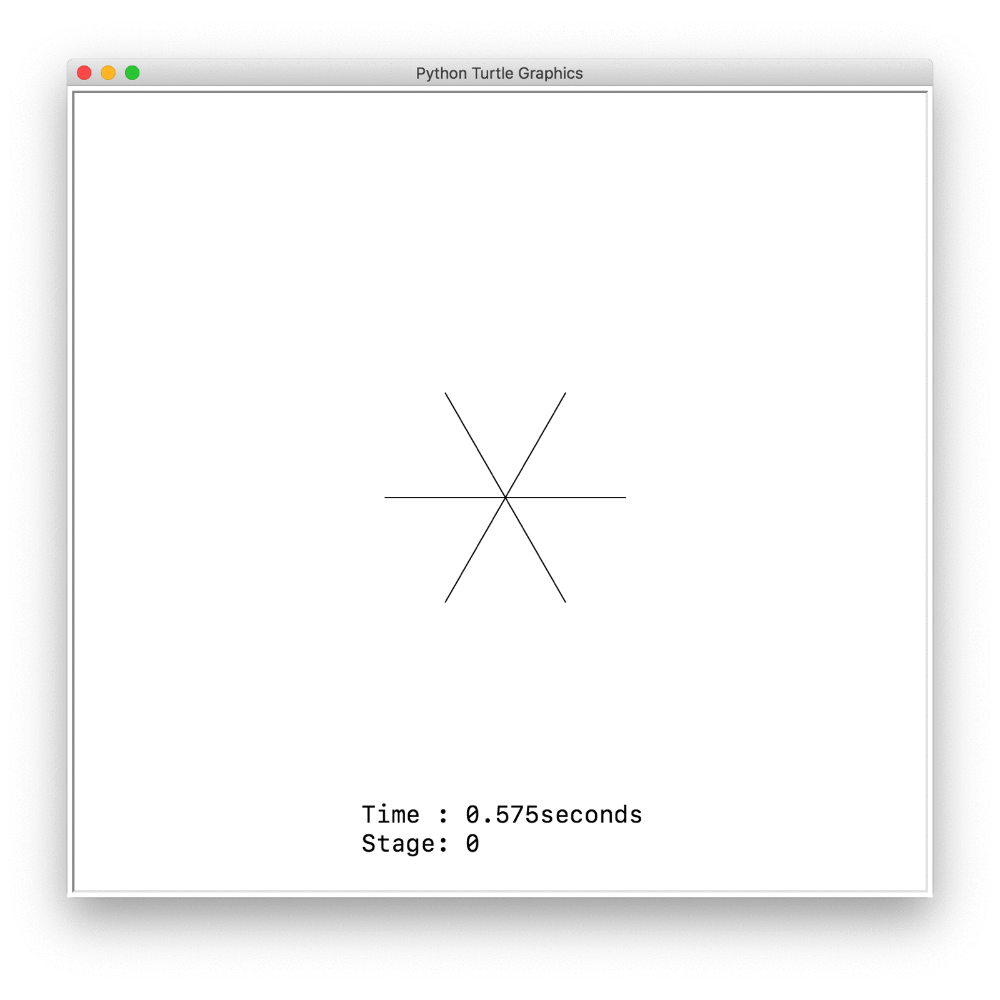

# Snowflake.py

###### Developed by Sunghyun Cho on July 6th, 2018.

### Feature

Draws SnowFlake with Python Turtle Graphics



### Code

```python
from turtle import *
import time

def SnowflakeBranch(currentPos, forwardLength, tiltDeg, terminatingLength):
	if forwardLength >= terminatingLength:

		turtle = Turtle()
		turtle.speed('fastest')

		turtle.hideturtle()
		turtle.penup()
		turtle.setpos(currentPos)
		turtle.pendown()
		turtle.setheading(tiltDeg)
		turtle.forward(forwardLength)

		pos = turtle.pos()
		tilt= tiltDeg

		SnowflakeBranch(pos, forwardLength/(3), tilt - 120, terminatingLength)
		SnowflakeBranch(pos, forwardLength/(3), tilt - 60 , terminatingLength)
		SnowflakeBranch(pos, forwardLength/(3), tilt      , terminatingLength)
		SnowflakeBranch(pos, forwardLength/(3), tilt + 60 , terminatingLength)
		SnowflakeBranch(pos, forwardLength/(3), tilt + 120, terminatingLength)

screen = Screen()
screen.tracer(1,1)

recurseNum = int(input("몇 번 반복할까요? : "))

terminateAt = 100/((3)**(recurseNum))

start_time = time.time()

SnowflakeBranch((0, 0), 100, 60, terminateAt)
SnowflakeBranch((0, 0), 100, 120, terminateAt)
SnowflakeBranch((0, 0), 100, 180, terminateAt)
SnowflakeBranch((0, 0), 100, 240, terminateAt)
SnowflakeBranch((0, 0), 100, 300, terminateAt)
SnowflakeBranch((0, 0), 100, 0, terminateAt)

string = ("     소요 시간 : " + str(int((time.time() - start_time)*1000)/1000) + "초\n     단계 : "+str(recurseNum))

turtle = Turtle()
turtle.hideturtle()
turtle.penup()
turtle.goto(-180, -200)
turtle.write(string, move=False, align="left", font=("Menlo", 20, "normal"))

input("Return (Enter)를 눌러 종료하세요. ")
```
